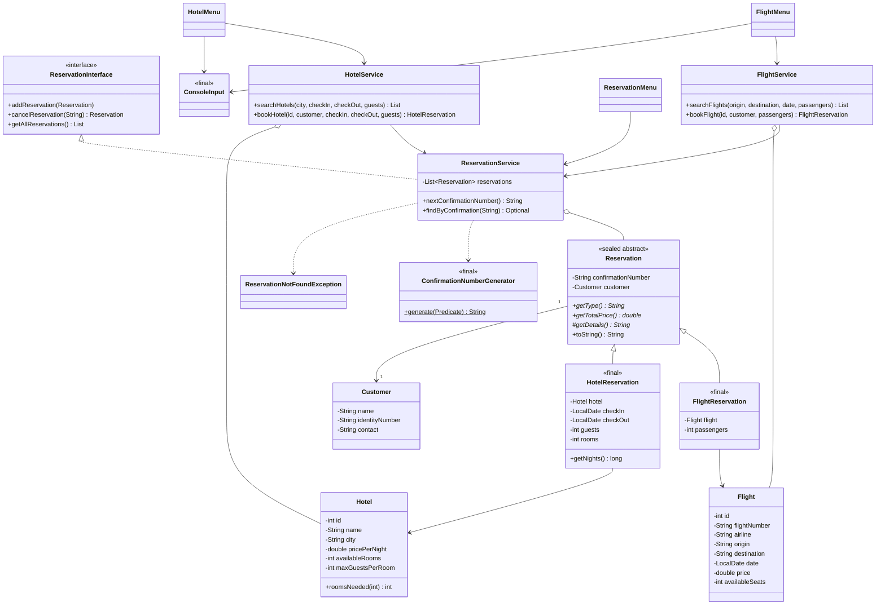
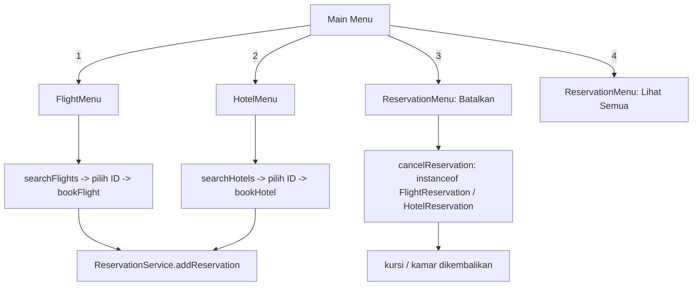

# minitraveloka-java

Aplikasi konsol Java untuk memesan **tiket pesawat dan hotel** (terinspirasi Traveloka / Tiket.com).
Tugas Kelompok 2 - Introduction to Programming for Business (COSC6047035).

Fitur: cari & pesan penerbangan, cari & pesan hotel, batalkan reservasi (nomor konfirmasi),
lihat semua pemesanan, serta validasi input.

---

## Struktur Folder

```text
minitraveloka-java/
├── Main.java                              # Entry point & router menu utama
├── Services/
│   ├── Flights/
│   │   ├── Flight.java                    # Entitas penerbangan (field private + getter/setter)
│   │   ├── FlightService.java             # Inventori, pencarian, pemesanan penerbangan
│   │   └── FlightMenu.java                # Tampilan menu penerbangan
│   ├── Hotels/
│   │   ├── Hotel.java                     # Entitas hotel
│   │   ├── HotelService.java              # Inventori, pencarian, pemesanan hotel
│   │   └── HotelMenu.java                 # Tampilan menu hotel
│   ├── Customer/
│   │   └── Customer.java                  # Data pelanggan (nama, identitas, kontak)
│   ├── Reservation/
│   │   ├── Reservation.java               # sealed abstract class
│   │   ├── FlightReservation.java         # final, turunan Reservation
│   │   ├── HotelReservation.java          # final, turunan Reservation
│   │   ├── ReservationInterface.java      # Kontrak pengelolaan reservasi
│   │   ├── ReservationService.java        # Penyimpanan, pembatalan, daftar reservasi
│   │   ├── ReservationMenu.java           # Menu batalkan & lihat semua
│   │   ├── ReservationNotFoundException.java   # Custom exception
│   │   └── ConfirmationNumberGenerator.java    # final class, nomor 6 digit (Random)
│   └── Utils/
│       ├── ConsoleInput.java              # Pembaca input aman (validasi + retry)
│       └── CurrencyFormatter.java         # final class, format Rupiah
└── README.md
```

## Cara Menjalankan

Butuh **JDK 17 atau lebih baru** (memakai sealed class, pattern matching, dan text block).

## Cara Pakai (ringkas)

| Menu utama | Fungsi |
|---|---|
| 1 | Menu penerbangan: `11` cari (asal, tujuan, tanggal, penumpang) lalu pilih ID untuk memesan, `12` pesan langsung dengan ID, `13` lihat semua |
| 2 | Menu hotel: `21` cari (kota, check-in, check-out, tamu) lalu pilih ID untuk memesan, `22` lihat semua, `23` pesan langsung dengan ID |
| 3 | Batalkan reservasi dengan nomor konfirmasi (penerbangan maupun hotel) |
| 4 | Lihat semua pemesanan + total nilai |
| 99 | Keluar |

Data contoh penerbangan memakai tanggal **relatif terhadap hari ini** (besok s.d. 3 hari lagi),
jadi coba cari `Jakarta` -> `Bali` dengan tanggal besok. Format tanggal: `yyyy-MM-dd`.
Kota hotel yang tersedia: Jakarta, Bali, Yogyakarta, Surabaya, Bandung, Medan.

---

## Desain OOP

**Diagram kelas (UML):**



**Alur aplikasi:**



## Pemetaan ke Rubrik / Topik

| Topik | Lokasi dalam kode |
|---|---|
| I/O konsol, variabel, tipe data | `ConsoleInput`, semua `*Menu` |
| Kelas, objek, konstruktor, `toString()` | `Flight`, `Hotel`, `Customer`, `*Reservation` |
| Seleksi & perulangan | `Main` (`while` + `switch`), menu, `ConsoleInput` (loop validasi) |
| Koleksi | `List<Flight>`, `List<Hotel>`, `List<Reservation>` (`ArrayList`) |
| Enkapsulasi | Semua field `private` dengan getter/setter |
| Pewarisan & polimorfisme | `Reservation` -> `FlightReservation`, `HotelReservation`; `getTotalPrice()`, `getDetails()`, `toString()` dipanggil lewat tipe induk |
| Kelas abstrak & antarmuka | `Reservation` (abstract), `ReservationInterface` |
| Sealed & final | `sealed ... permits`; subclass `final`; `ConfirmationNumberGenerator`, `CurrencyFormatter`, `ConsoleInput` bertipe `final` |
| Pattern matching | `ReservationService.cancelReservation` (`instanceof FlightReservation fr`) |
| Lambda & stream | `filter`, `sorted(Comparator...)`, `mapToDouble`, `anyMatch`, `forEach(System.out::println)`, `Predicate` pada generator nomor |
| Penanganan eksepsi | `NumberFormatException`, `DateTimeParseException`, `IllegalArgumentException`, `IllegalStateException`, custom `ReservationNotFoundException` |

## Catatan Desain

- Di *unnamed module*, subclass `sealed` harus satu package dengan induknya. Karena itu
  `FlightReservation` dan `HotelReservation` berada di package `Services.Reservation`.
- Ketersediaan kamar hotel dihitung per hotel (stok kamar), bukan per tanggal, untuk menjaga kesederhanaan.
- Data hanya disimpan di memori; semua data kembali ke awal saat aplikasi ditutup.

## Perubahan dari Versi Awal (hanya penerbangan)

- Menambah modul **Hotel** (`Hotel`, `HotelService`, `HotelMenu`).
- `Reservation` diubah menjadi `sealed abstract` dengan `FlightReservation` dan `HotelReservation`.
- Nomor reservasi `R1, R2, ...` diganti nomor konfirmasi acak 6 digit yang unik (sebelumnya bisa duplikat setelah pembatalan).
- Pencarian penerbangan kini memakai asal, tujuan, tanggal, dan jumlah penumpang (sebelumnya kata kunci); kursi dikurangi sebanyak jumlah penumpang.
- Pembatalan dipindah ke menu utama agar berlaku untuk penerbangan **dan** hotel.
- Menambah `ConsoleInput` (menghilangkan kode input yang duplikat), custom exception, pattern matching, dan test.
